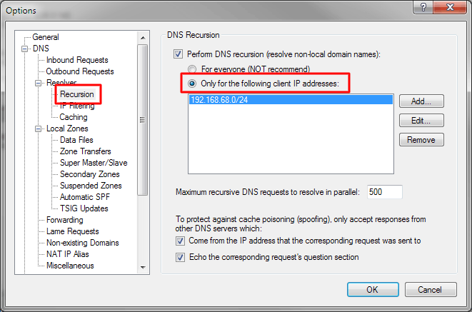
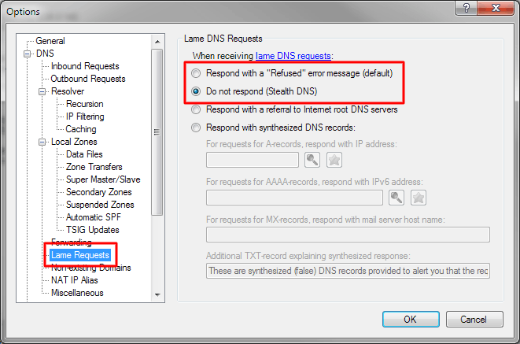
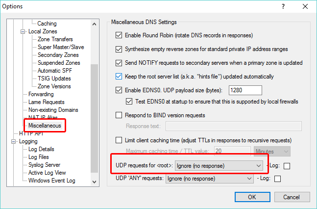

---
category: 7
frontpage: false
comments: true
created-utc: 2019-01-01
modified-utc: 2019-01-01
---
# What is a DNS amplification attack and how to mitigate it

In a DNS amplification attack, a large number of DNS request are sent with a spoofed from-IP-address to one or more DNS servers.  
Depending on configuration, these DNS servers will send a response back to the IP address that the request appeared to originate from.  
  
Typically the DNS request packets are designed to trigger a response packet which is larger than the original request packet - thus the "amplification".  
  
The goal of the attack is to flood the victim (whoever owns the spoofed IP address) with large DNS response packets - ultimately overloading the victim's network / systems.  
The DNS servers involved are simply used as relays, and because a large number of DNS servers are often used, the individual DNS servers owners may not notice any significant spike in traffic - perhaps as little as a few extra requests per second - even when involved in a massive attack.  
  
The victim of the attack is not be able tell where the attack originates from - to him it appears that the attackers are the DNS servers.  
To the owners of the DNS servers (who may not even notice it) - it appears that the attacker is the victim - since the requests appear to originate from his IP address.  
  
When/if the owners of the abused DNS server notice this, they will typically see incoming DNS requests that are:  
a) Lame requests (recursive request for non local domain names from an IP address that the DNS servers does not recurse for)  
b) Requests for &lt;root&gt;  
c) Requests for the record type "ANY" (logged as *).  
d) Repeated requests from a single or a few IP addresses.  
  
  
We do **<u>NOT</u>** recommend blocking the apparent sender's IP address on your firewall, with IPSec, or anything else at the IP address level - that is exactly what the attacker wants you to do! By blocking the apparent sender IP addresses, you are really blocking the victim rather than the attacker - because the sender IP address is spoofed as the victim's.  

The aim of the attack is twofold: (1) overload the victim's Internet connection with large DNS responses, and (2) make everybody firewall the victim, so he can't use his connection even after the attack.

As a DNS server owner, the best way to counter this type of attack is to make your DNS server unattractive as a "way-point".

There are 4 things you can do:

1) Make sure that you don't offer recursion to non local IP addresses ([don't be an "open DNS server"](/kb/155/what-is-an-open-dns-server-and-how-do-i-fix-it)).  
  
In the Options dialog / DNS / Resolver / Recursion section, either turn off recursion completely if you don't need it, or limit it to your own IP address range(s):  

  
2) Configure Simple DNS Plus to either ignore or refuse lame requests.

In the Lame Requests section, select either "Respond with a Refused error message" or "Do not respond":  

  

Generally we recommend using the "Refused" option as this makes it easier to troubleshoot other DNS issues. However if this attack is continuously hitting your server, you will do the victim a favor using the "Do not respond" option. When no longer under attack, you can switch to the "Refused" option which still ensures that your server is not attractive as a way-point for this type of attack - since it won't amplify traffic.

3) If the requests are mostly for &lt;root&gt;, another way to deal with this traffic, and keep it out of the log at the same time, is setting the "UDP requests for &lt;root&gt;" option to "Ignore (no response)" - found in the Miscellaneous section:

  
4) If the requests are mostly for record type ANY (logged as *), you can set the "UDP 'ANY' requests" option to "Ignore (no response)" - also in the Miscellaneous section:

