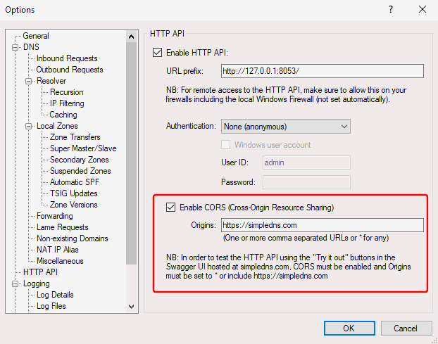
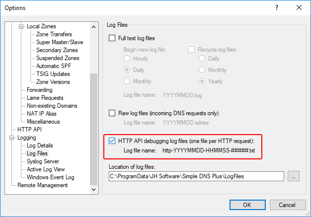
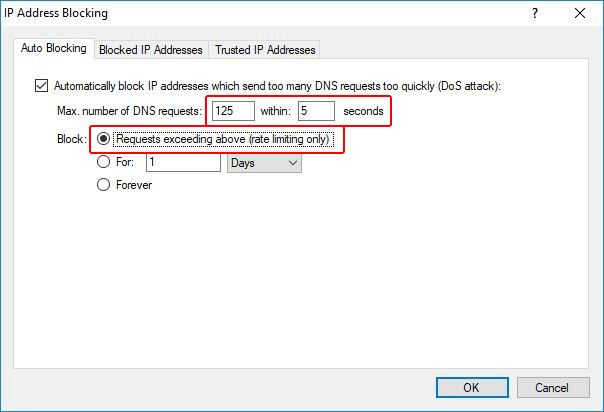

---
category: 17
frontpage: false
comments: true
vgroup: 7
vname: v. 7.0
vsort: 70
created-utc: 2019-01-01
modified-utc: 2019-01-01
---
# New in Simple DNS Plus (v. 7.0)

New features in v. 7.0:

- [New HTTP API \(v. 2\)](#newhttpapi)
- [HTTP API - CORS support](#cors)
- [HTTP API - SSL support](#ssl)
- [HTTP API - debugging log files](#log)
- [New zone account-ID setting](#acctid)
- [Import zones from a Simple DNS Plus v. 6.0 / 7.x database file](#import)
- [Enhanced auto IP address blocking](#ipblock)
- [Miscellaneous](#misc)
- [Retired](#retired)

### New HTTP API (v. 2){#newhttpapi}

Redesigned with the following enhancements:

- **REST** based (URL design, HTTP methods, etc.)
- **JSON** format for all data (no more XML)
- Retrieve and update **zone configuration data** (not just records) including zone type (primary/secondary), primary server IP address, default-TTL, zone transfer key, zone transfer permissions, dynamic update permissions, also-notify list.
- Retrieve **zone status information** (serial number, refresh time).
- Retrieve and update **IP Address Blocking** configuration (auto block settings, blocked / trusted lists).
- List, add, remove, update **plug-in instances**.
- Update **individual Options** (from Options dialog) separately through PATCH.
- Enhanced `updatehost` shortcut method to easily create/update/delete host records - now accepts multiple IPv4/IPv6 addresses in a single request.

Explore the new HTTP API at <https://simpledns.plus/swagger-ui>

The original HTTP API (v. 1) is still included in this version of Simple DNS Plus. It is however deprecated, it will no longer be updated, and it will be removed in a future version.

### HTTP API - CORS support{#cors}

[CORS](https://en.wikipedia.org/wiki/Cross-origin_resource_sharing) allows a web-page running in a browser to access resources hosted on a different web-site (diffent host name / port).

Enabling this new option, allows you to access the Simple DNS Plus HTTP API with javascript on a web-page.

This enables some new possible uses of the HTTP API - such as building a HTTP based admin UI.

### HTTP API - SSL support{#ssl}

The HTTP API can now be served securely via SSL (https://...).

For details on how to associate an SSL certificate with the HTTP API URL, [click here](/kb/163/how-to-bind-an-ssl-certificate-to-the-http-api).

### HTTP API - debugging log files{#log}

New option to write full headers and payload of each HTTP API request to an individual log file.
Use this to see the exact details of HTTP API client requests, for debugging purposes.

WARNING: This can quickly add up to a lot of log files and data. Make sure to only enable this when needed.

Options dialog / Logging / Log files section / "Write HTTP API debugging log files (one file per HTTP request)":

### New zone account-ID setting{#acctid}

To track the domain name owner or similar.

This is primarily intended for use with the new HTTP API - allowing you to filter the zone list by account (GET /zones?account=xxx)

### Import zones from a Simple DNS Plus v. 6.0 / 7.x database file{#import}

In the Import Wizard (DNS Records window / File menu / Import...), when you select "Import a set of zones listed in a DNS server boot/configuration file", there is a new file format option "Simple DNS Plus v. 6.0 / 7.x 'sdnsplus.db' file".

This can be used to import zones from another Simple DNS Plus instance or backup.

### Enhanced auto IP address blocking{#ipblock}

Instead of a maximum number of requests within a single second, it is now possible to specify a longer period. This allows for "spikes" while still blocking sustained high request rates.

And it is now possible to only block excess requests (rate limiting).

### Miscellaneous{#misc}

- Plug-in export/import function in GUI (via clipboard) is now in JSON format instead of XML.
- Included "named.root" file (a.k.a. "root hints file") updated to v. 2018041201.
- Various internal configuration settings in the "sdnsplus.db" database now in JSON format instead of XML (matching new HTTP API).
- Comments on blocked IP addresses (IP address blocking dialog) now show up in the log when a request is blocked.

### Retired{#retired}

- Retired The HTTP API "Accept HTTP connections from" setting (IP address list).\
Typically a Windows Firewall entry is required to enable remote access to the HTTP API anyway, and so client IP address restrictions can be configured there.\
When upgrading from an older version where this setting was used, the HTTP API is automatically disabled to prevent abuse (can be re-enabled in the Options dialog).
- Retired the "Prefer IPv6 DNS servers when resolving non-local domain names" option (Options dialog / DNS / Outbound Requests). This is now permanently on when outbound requests via IPv6 is enabled.