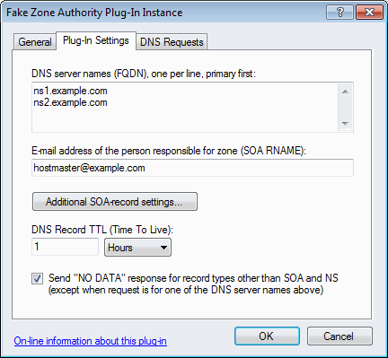
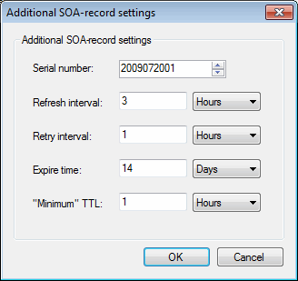

---
category: 8
frontpage: false
comments: true
refs: 110
created-utc: 2019-01-01
modified-utc: 2020-01-07
---
# Fake Zone Authority plug-in

This plug-in allows domain names to pass common tests performed by domain name registrars and similar without having to setup an actual zone for each domain name.

This can be useful for example if you have a lot of domain names that are either served by other plug-ins or are inactive.

Specifically, this plug-in provides synthesized SOA- and NS-records indicating that this DNS server is authoritative for whatever name that is requested. Optionally the plug-in will also respond to requests for other record types with a "NO DATA" response (a standard DNS response indicating that no records exist for the request name and type).

On the "Plug-In Settings" tab, specify the following settings (explained below the image):

  

- **DNS server names (FQDN)**  
Enter the DNS server host names that should be returned in SOA- and NS-records.  
SOA-records will only include the first DNS server name, which must be the primary DNS server.  
Responses to requests for NS-record will include one NS-record for each server name listed.
- **E-mail address of the person responsible for zone**  
Enter the e-mail address to be returned in SOA-records.
- **Additional SOA-record settings**  
Click this button to specify additional SOA-record settings in the following dialog.  
Note that these settings are not really going to be used for anything, but some registrars might complain if they are not setup according to their liking. The default settings should satisfy most such tests.  

- **DNS Record TTL (Time To Live)**  
How long the DNS records served may be cached by other DNS servers / caches.
- **Send "NO DATA" response for record types other than SOA and NS**  
Provide a standard DNS response indicating that no records exist for the request name and type.  
Note that if this option is not checked, the plug-in provides no response to requests for record types other than SOA and NS.

WARNING: By default, this plug-in responds to all DNS requests. If you only want it to respond for specific names or want to specify exceptions, you can limit which DNS requests are processed using the settings in the "DNS Requests" tab.

