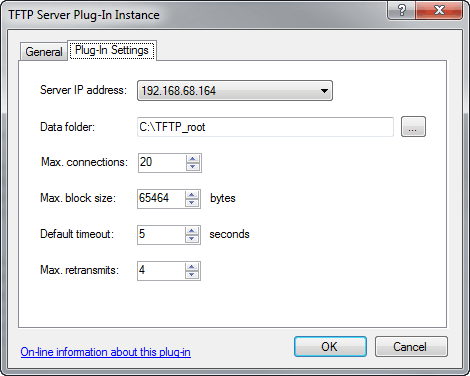

---
category: 8
frontpage: false
comments: true
refs: 110,73
created-utc: 2019-01-01
modified-utc: 2020-01-08
---
# TFTP Server plug-in

This plug-in provides TFTP (Trivial File Transfer Protocol) server functionality.

It supports the "blksize", "timeout" and "tsize" options (implements RFC1350, 2347,2348, and 2349).

TFTP is typically used in combination with [DHCP](https://simpledns.plus/kb/169) to enable PXE / diskless booting of PCs, provisioning IP phones, etc.  
An example of this is provided in [KB73 - How to serve a network based Debian Linux installation with Simple DNS Plus](https://simpledns.plus/kb/73).

On the "Plug-In Settings" tab, enter the following settings (explained below the image):

- **Server IP address**  
The local IP address that the plug-in should listen for incoming requests on (UDP port 69).
- **Data folder**  
The local folder to serve files from.  
IMPORTANT: Make sure to specify a folder on a local harddisk as the service is not be able to access network shares.
- **Max. connections**  
The maximum number of simultaneous connections (file transfers).
- **Max. block size**  
The maximum size (in bytes) of individual data blocks.  
The default block size is 512, but clients may request a larger block size ("blksize" option).  
You may need to adjust this setting if you network limits UDP packet size.
- **Default timeout**  
How long the server should wait for acknowledgeent that a client received the last data block.  
When the timeout expires, the last data block will be resent.  
Clients may request a different timeout value ("timeout" option).
- **Max. retransmits**  
The maximum number of times a data block will be resent (after timeout or repeat request from client).

To test your setup, you can use the TFTP command line tool.  
Note that in recent Windows version this first needs to be enabled from the Windows Control Panel / Programs &amp; Features / Turn Windows features on or off / TFTP client.

The Simple DNS Plus log (Active Log View and log files) will show the request:

IMPORTANT: TFTP has no built-in security (authentication or otherwise). Anyone who can access the server's IP address / UDP port 69 can download all the files in the data folder and sub-directories.  
We recommend that you limit access with a firewall, or enable the plug-in only on private IP addresses.  
This plug-in does not support writes/uploads so there is no risk of new files being uploaded or existing files being altered.

NOTE: This plug-in does not provide any DNS records or any other functionality related to directly to DNS. But you can of course point domain names to the IP address that the plug-in listens for connections on, using A-records provided through local zones or other plug-ins.

Note: Requires Simple DNS Plus v. 5.2 build 111 or later.

