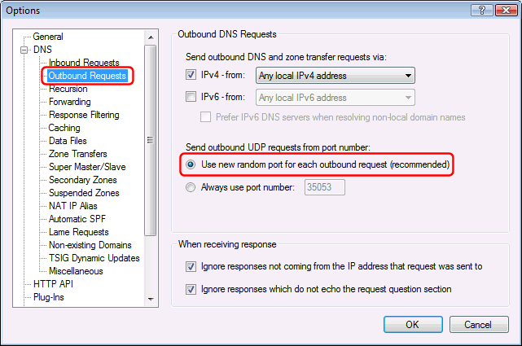
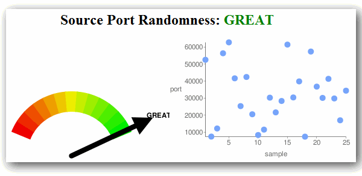

---
category: 7
frontpage: false
comments: true
created-utc: 2019-01-01
modified-utc: 2019-01-01
---
# Dan Kaminsky's DNS bug / VU#800113

On July 8th 2008 the US-CERT issued [Vulnerability Note VU#800113](http://www.kb.cert.org/vuls/id/800113){target=_blank} about DNS implementations being vulnerable to cache poisoning - causing a lot of media attention at the time.  
This was based on a DNS protocol vulnerability discovered by [Dan Kaminsky](http://www.doxpara.com/){target=_blank}.

Simple DNS Plus v. 5.1 and later with the default configuration is not vulnerable to this, but earlier versions may be - see details below.

This vulnerability is a twist on classic DNS spoofing / cache poisoning, where false DNS records are injected into a DNS server's cache, causing domain names to resolve to the wrong IP addresses - potentially re-routing Internet traffic to malicious servers etc.  
This class of attacks is nothing new - Kaminsky's variant is just more effective than the classic approach (flooding DNS server with spoofed responses).  
Recursive DNS servers generally identify and accept response packets based on a very short identifier (16 bit).  
This is exploited by sending (or causing) a series of recursive DNS requests for dummy sub-names under the name to be spoofed (like "1.example.com", "2.example.com", "3.example.com") and at the same time sending spoofed responses back to the target DNS server.  
By using a different (dummy) sub-name for each attempt, the hacker avoids having to wait for data from the previous attempt to time out and be flushed from the cache before making the next attempt.  
Within a relatively short time the hacker will hit the correct identifier (should happen within 65536 attempts) and get his spoofed response cached by the DNS server.  
Of course there is no point in spoofing these dummy sub-names, but the spoofed response will also contain DNS records for the parent name in the "additional section" - which the spoofed DNS server will also cache and which will override any DNS records previously cached.

First note that this vulnerability only applies to recursive DNS servers.  
If recursion is disabled on your DNS server - it is not vulnerable.  
If your DNS server is only hosting domains names (authoritative server only), simply disable recursion, and you are safe.  
In Simple DNS Plus this is configured in the Options dialog / DNS / Recursion section.

For recursive DNS servers, currently the best way to mitigate this vulnerability is to use a DNS server with "port randomization" - or to forward to a DNS server that has this feature.  
A DNS server with "port randomization" sends outbound DNS requests from different port numbers (UDP) in random order and only accepts responses sent back to the same port number as each request was sent from.  
This in effect increases the response identifier from 16 to 32 bit (65,536 to 4,294,967,296 possible values).

<u>Simple DNS Plus v. 5.1 and later</u>

Simple DNS Plus version 5.1 and later has "port randomization" and fully implements the recommendations in VU#800113 including the draft [draft-ietf-dnsext-forgery-resilience](http://tools.ietf.org/html/draft-ietf-dnsext-forgery-resilience){target=_blank}.

If you allow recursion (from any IP), make sure "port randomization" is enabled (default) in the Options dialog / DNS / Outbound Requests section:

**IMPORTANT:** Even with port randomization, your DNS server may still be vulnerable if it is behind a NAT server which does not preserve the port numbers that outbound DNS requests are sent from. So it is important to test your setup:

Several on-line tests are available to test a DNS server's "port randomization" feature (or lack of it).  
For example [DNSStuff.com](http://member.dnsstuff.com/tools/vu800113.php){target=_blank} and [DNS OARC](https://www.dns-oarc.net/oarc/services/dnsentropy){target=_blank}.  
Test results with the later against Simple DNS Plus (v. 5.1 build 106 and later) should look like this:

<u>Simple DNS Plus v. 5.0 and earlier</u>

Simple DNS Plus v. 5.0 and earlier do not have port randomization, and we therefore recommend that you either upgrade to the current version or configure the older version to forward (see Options dialog / DNS / Forwarding) to a DNS server that does have the feature.  
If you do not have another DNS server to forward to yourself, you might consider forwarding to OpenDNS.com (see [instructions here](/kb/128/using-opendns_com-with-simple-dns-plus)) or something similar.

Note that in order to exploit this vulnerability, the attacker has to somehow trigger your DNS server into resolving a lot of domain names.  
You can make this much harder by restricting DNS recursion to trusted IP addresses (Simple DNS Plus Options dialog / DNS / Recursion). This way the attacker has to get you to visit his web-page with some very fancy scripting or something similar in order to trigger the DNS lookups and resolving.

Over the years we have added many other features to Simple DNS Plus to help protect against cache poisoning / spoofing attacks, making it more resilient with each new release. So the newer the version the harder it is to successfully attack it.  
For more details on how Simple DNS Plus protects against cache poisoning, please see  
[https://simpledns.plus/helplink?p=ht_secure&amp;b=spoofing](https://simpledns.plus/helplink?p=ht_secure&b=spoofing)

