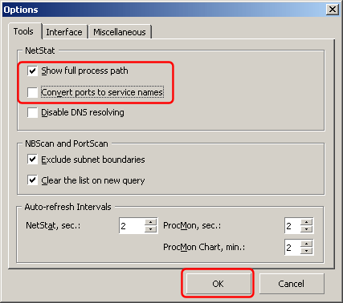
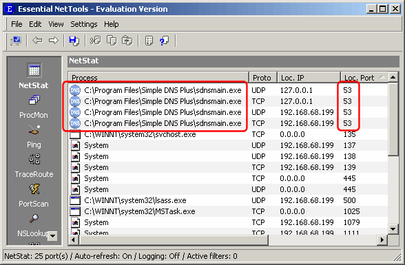

---
category: 14
frontpage: false
comments: true
refs: 46
created-utc: 2019-01-01
modified-utc: 2019-01-01
---
# Error message "Could not start DNS service on &lt;ip-address&gt; port 53 UDP. Port is used by another application" or "Could not start DNS service (Error 10048)"

This error message means that some other software on your computer is using the DNS port (53).

If you are running Simple DNS Plus on Windows 98se/2000 or later, it could be that you are using "Internet Connection Sharing", which "maps" DNS requests and uses the same port (53) as DNS servers.  
See [How do I use Simple DNS Plus with Internet Connection Sharing?](/kb/132/using-simple-dns-plus-with-internet-connection-sharing-ics)

Proxy servers often include a DNS proxy/mapping function which can cause this.  
See [How do I use Simple DNS Plus with a proxy server?](/kb/56/how-do-i-use-simple-dns-plus-with-a-proxy-server)

Other software like network monitors could also by occupying port 53.

To find out what software is using the DNS port:

**<u>Windows XP (SP2) / Server 2003 (SP1) and later Windows versions</u>**

At a command prompt, type "NETSTAT -nabp UDP" to also see which application is using each UDP port.

**<u>Windows NT4 / 2000</u>**

You can use "Essential NetTools" to find out which programs are using which ports.  
You can download an evaluation version of this program from [www.tamos.com](http://www.tamos.com/){target=_blank}.

From the "Settings" menu, select "Options...".  
Under Tools/NetStat, check "Show full process path", and UN-check "Convert ports to service names", and click the "OK" button:

Back in the main window, locate programs using port 53:

The above sample shows Simple DNS Plus using these ports - you should see some other program.

