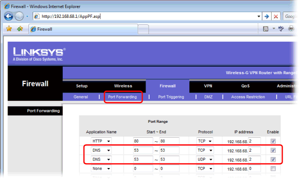

---
category: 6
frontpage: false
comments: true
created-utc: 2019-01-01
modified-utc: 2019-01-01
---
# How do I use Simple DNS Plus with my Cable/DSL Router (NAT Router)?

Computers and devices behind a NAT router all have private IP addresses (typically 192.168.x.x), which are translated into a shared public IP addresses by the router.

To run a server behind the router, incoming TCP/IP traffic must be "mapped" to the server on a private IP address based on port numbers.  
NAT routers typically have a web interface with a section where you can configure "port mappings", "port forwarding", or something similar.

Simple DNS Plus (and other DNS servers) use port number 53 UDP and TCP.

So you need to map for incoming traffic to port 53 to be forwarded to the local IP address of the computer running Simple DNS Plus.  
With some routers you must create two separate mappings - one for each protocol "UDP" and "TCP".  
Other routers allow you to do this with a single port mapping for "BOTH".

This sample screen shot is from a Linksys router:

NOTE: If you are running servers (any type) behind a NAT router, the DNS records for these servers must point to the public Internet IP address - not the private server IP address (192.168.x.x).

