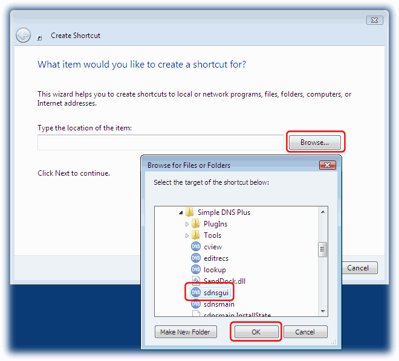
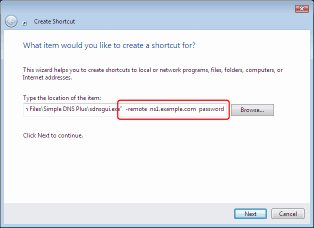
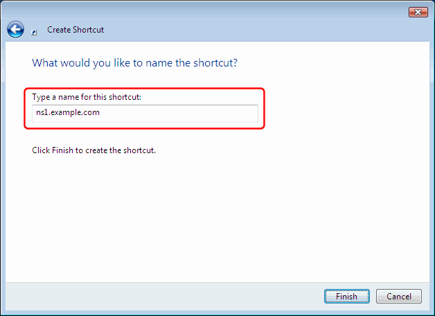

---
category: 11
frontpage: false
comments: true
created-utc: 2019-01-01
modified-utc: 2019-01-01
---
# How to prefill server name, port, and password for remote management

Note: Remote management is available in Simple DNS Plus v. 5.2 and later only. [Details](https://simpledns.plus/news/5).

If you frequently remote manage a Simple DNS Plus server, you can create a desktop shortcut with the remote server name and password prefilled to make it quicker to access the server.

First, right-click on your Windows desktop, and from the pop-up menu select "New" and "Shortcut":

In the "Create Shiortcut" dialog, click the "Browse" button and locate the "sdnsgui.exe" file in the directory where Simple DNS Plus is installed (typically c:\program files\Simple DNS Plus):

After the file name, add a space, then "-remote", a space, the remote computer host name or IP address, a space, and the remote management password.  
If remote management is configured to use a port other than the default (9053), you can specify the port number as part of the computer host name or IP in the format "computer:port".

Click the "Next" button, and enter a name for the shortcut (for example the name of the remote server):

Cilck the "Finish" button, and the shortcut is ready to use:

Follow the same procedure for "editrecs.exe" if you want to create a shortcut to access the DNS Records module directly.

