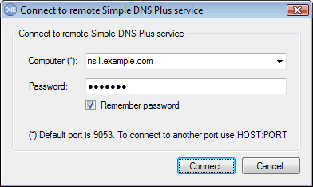
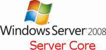
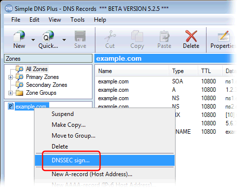
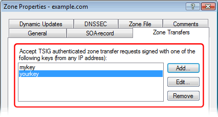
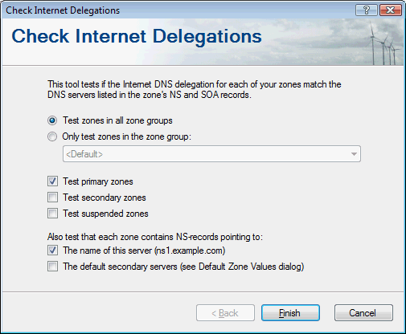
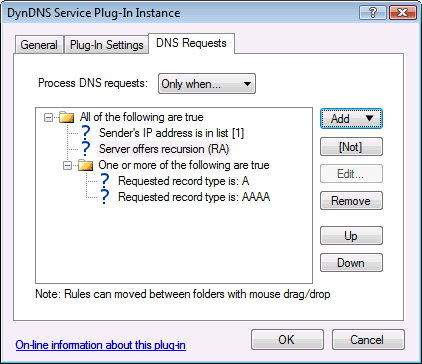

---
category: 17
frontpage: false
comments: true
vgroup: 7
vname: v. 5.2
vsort: 52
created-utc: 2019-01-01
modified-utc: 2019-01-01
---
# New in Simple DNS Plus (v. 5.2)

New features in v. 5.2:  
[Remote Management](#remote)  
[Runs on Windows "Server Core"](#core)  
[DNSSEC](#dnssec)  
[Secure Zone Transfers (TSIG signed)](#seczt)  
[Check Internet Delegations wizard](#chkdel)  
[Windows Performance Counters](#perfctr)  
[High performance, multi-threaded plug-in processing](#mtpi)  
[DNS request "rules" for plug-ins](#rules)  
[Enhanced DNS Look Up tool](#lookup)  
[New standard plug-ins](#stdpi)  
[Miscellaneous updates / changes](#misc)  
[New RFC and draft support](#rfc)

### Remote Management{#remote}

You can now use the normal Simple DNS Plus user interface on a remote computer.  
For details see [this news article](https://simpledns.plus/news/5).

### Runs on Windows "Server Core"{#core}

You can now run Simple DNS Plus on Windows Server Core.  
For details see [this article](/kb/119/simple-dns-plus-on-windows-server-core).

### DNSSEC{#dnssec}

Simple DNS Plus can now host DNSSEC signed zones and includes GUI tools for DNSSEC key management and zone signing. For details see [this news article](https://simpledns.plus/news/2), [this article](/kb/65/how-to-dnssec-sign-a-zone-with-simple-dns-plus), and this article [RETIRED].

### Secure Zone Transfers (TSIG signed){#seczt}

Simple DNS Plus now supports secure zone transfer (TSIG authenticated).  
Both zone transfer requests and responses are authenticated, so this provides protection in two ways; it prevents unauthorized transfers (only people / servers with the correct key can transfer), and it ensures data integrity on secondary servers (not possible to spoof / inject false data during transfers).  
For details see [this news article](https://simpledns.plus/news/6).

### Check Internet Delegations wizard{#chkdel}

This new wizard lets you automatically test if the NS and SOA records in your local zone data match the actual current delegations on the Internet. This can be very useful both to check for errors and to make sure that you still own the domain names that you think you do. It could also be used for example by ISPs to see if any customers have left them (changed their DNS to another provider).

### Windows Performance Counters{#perfctr}

Simple DNS Plus now supplies 9 different performance counters which can be graphed with the Windows Performance Monitor and polled by other programs such as SNMP tools:

### High performance, multi-threaded plug-in processing{#mtpi}

All plug-in processing is now performed asynchronously (in separate threads) so that other DNS requests that are not processed by the plug-in can proceed without delay.  
We have also added the option for plug-ins to process multiple DNS requests in parallel. This can improve plug-in performance significantly - especially for resources on multi-core computers.

Multi threading is currently available in the [MS SQL Server](https://simpledns.plus/plugin-mssql), [MS SQL Server Plus](https://simpledns.plus/plugin-mssqlplus), and the [MySQL Server](https://simpledns.plus/plugin-mysql) plug-ins, and is of course also available for implementation by 3rd party plug-in developers.

### DNS request "rules" for plug-ins{#rules}

New "rule engine" and GUI editor for setting up "rules" controlling which DNS requests are processed by each plug-in. This is configured in new "DNS Requests" tab - which replaces the "DNS Ask About" and "DNS Access" tabs.  
Plug-ins can provide custom "rules" for other plug-ins. For example; you can setup a rule that a plug-in may only be queried from IP addresses listed by another plug-in. Such rules may be based on databases or practically anything else you can think of.

More details are available in [this article](/kb/110/plug-ins-in-simple-dns-plus).

### Enhanced DNS Look Up tool{#lookup}

New options pane docked in main window for quick and easy access, separate DNS and WHOIS server fields, new server port fields, and new DNSSEC options / output:

### New standard plug-ins{#stdpi}

- New "Skip" plug-in.  
Replaces "Scheduler" and "Domain Whitelist" plug-ins. [More details...](https://simpledns.plus/plugin-skip)
- New "Fixed IP Address" plug-in.  
Returns a fixed IP address to all A/AAAA requests. [More details...](https://simpledns.plus/plugin-fixedip)
- New "Fixed Host Name" plug-in.  
Returns a fixed host name - either as a CNAME record for all requests, or as MX/NS/PTR records. [More details...](https://simpledns.plus/plugin-fixedhostname)
- New "Ignore DNS Request" plug-in.  
Instructs Simple DNS Plus to ignore (not answer) specified DNS requests. [More details...](https://simpledns.plus/plugin-ignorereq)

### Miscellaneous updates / changes{#misc}

- Runs on Windows 7 and Windows 2008 R2.
- Support for DHCID records (RFC4701).
- Support for RFC4635 "HMAC SHA TSIG Algorithm Identifiers" - both for TSIG signed dynamic updates and for zone transfers.
- Active Log View can be paused (from main View menu / log right-click menu / F9 key).
- Options / DNS / Resolver / Caching: New separate setting for maximum cache time for negative responses.
- Options / DNS / Local Zones / Data Files: New "Maximum TTL" option.
- Options / DNS / Lame Requests: Default changed to "Respond with a Refused error message" (moved to top of list).
- New plug-in option: "Perform DNS recursion for IP addresses listed by this plug-in".
- New plug-in option: "Whitelist IP addresses listed by this plug-in from all DNSBLs".
- sdnsplus.exe is now dedicated to command line functions (no longer used to start Simple DNS Plus) and now also returns exit code 1 if a command line operation fails, which enables more advanced command line / PowerShell scripting scenarios.
- The New Zone wizard can now also create /8 and /16 reverse zones, and such existing zones are now recognized as reverse zones.
- DHCP plug-in: List of DHCP leases can now be exported to .csv and HTML (right-click menu in view).
- New Event ID 105 Error "Failed to start remote management on &lt;ip-address&gt; port &lt;port&gt; (&lt;error&gt;)".
- New Event ID 140 Warning "Open DNS Server. Limiting recursion to trusted IP addresses is recommended (Options dialog / DNS / Resolver / Recursion)".
- New Event ID 259 Warning "Thread queue error for plug-in".
- New exception option for Non-Existing Domains feature: "Do not redirect domain names that begin with an IPv4 address (reverse and RBL/DNSBL record names)" (build 108).
- Added support for new "Clone Answer" plug-in interface. See [this article](https://simpledns.plus/plugin-cloneresponse) (build 111).
- Added option to either ignore or "force TCP" for UDP 'ANY' requests (Options dialog / DNS / Miscellaneous section), and to log / not log these requests - to deal with DNS reflection/amplification attacks (build 123).  

- Added new free educational license type. [Details](/kb/48/free-educational-licenses) (build 132).  
  

### New RFC and draft support{#RFC}

- [RFC3225](http://www.rfc-editor.org/rfc/rfc3225.txt){target=_blank} - Indicating Resolver Support of DNSSEC (authoritative server)
- [RFC4033](http://www.rfc-editor.org/rfc/rfc4033.txt){target=_blank} - DNS Security Introduction and Requirements (signing and authoritative server)
- [RFC4034](http://www.rfc-editor.org/rfc/rfc4034.txt){target=_blank} - Resource Records for the DNS Security Extensions (signing and authoritative server)
- [RFC4035](http://www.rfc-editor.org/rfc/rfc4035.txt){target=_blank} - Protocol Modifications for the DNS Security Extensions (signing and authoritative server)
- [RFC4635](http://www.rfc-editor.org/rfc/rfc4635.txt){target=_blank} - HMAC SHA TSIG Algorithm Identifiers
- [RFC4641](http://www.rfc-editor.org/rfc/rfc4641.txt){target=_blank} - DNSSEC Operational Practices (signing and authoritative server)
- [RFC4701](http://www.rfc-editor.org/rfc/rfc4701.txt){target=_blank} - A DNS Resource Record (RR) for Encoding Dynamic Host Configuration Protocol (DHCP) Information (DHCID RR)
- [RFC5155](http://www.rfc-editor.org/rfc/rfc5155.txt){target=_blank} - DNS Security (DNSSEC) Hashed Authenticated Denial of Existence (signing and authoritative server)

