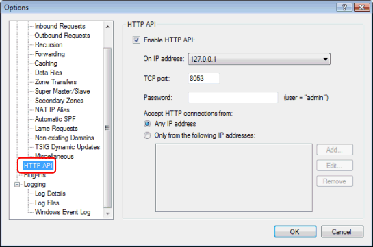

# Sending Simple DNS Plus HTTP Commands

Simple DNS Plus can be prompted to perform certain actions through HTTP - either directly from a browser, or any other program that can communicate through HTTP.

If you are running Simple DNS Plus 4.00 or later with the default configuration on the same computer that you are currently browsing from, [click here](http://127.0.0.1:8053/){target=_blank} to test with YOUR server (opens http://127.0.0.1:8053).

The settings related to this are configured in the Options dialog / HTTP API section:

Adjust these settings to match you IP addresses and security requirements.  
By default it listens on IP 127.0.0.1 which means that connections can only be made from the same computer.

The different "commands" that Simple DNS Plus can accept through the HTTP API are listed and described in the help file "How to use the HTTP API" section. See [on-line version](https://simpledns.plus/helplink?p=ht_http).

The following is a simple example of a web-page where a user can enter a host name and an IP address, and server side code that sends this data to Simple DNS Plus behind the scenes to create/update the A-record for the entered host name. This could be used as a simple dynamic DNS service.

Note this code is for demonstration purposes only - appropriate input validation and error checking should be added for this to be used on a real web-site.

Sample code in: [ASP.NET 2.0](#aspnet), [Classic ASP](#asp), [PHP](#php)

### ASP.NET 2.0{#aspnet}

To use this sample code, simply copy the code below into notepad, save it with a file name ending with ".aspx" in your web-site folder. The web-server and web-site must be configured for ASP.NET 2.0.

<pre></pre>
### Classic ASP{#asp}

The following classic ASP code uses the Windows HTTP Services 5.1 (WinHTTP) COM object to communicate with Simple DNS Plus. WinHTTP 5.1 is part of the Windows operating system for Windows 2000 SP3, Windows XP SP1, and all later Windows versions.  
To use this sample code, simply copy the code below into notepad, save it with a file name ending with ".asp" in your web-site folder. The web-server and web-site must be configured for classic ASP.

<pre></pre>
### PHP{#php}

The following PHP code uses the cURL library to communicate with Simple DNS Plus. cURL is typically installed with PHP and included with the full PHP distribution.  
To use this sample code, simply copy the code below into notepad, save it with a file name ending with ".php" in your web-site folder. The web-server and web-site must be configured for PHP.

<pre></pre>